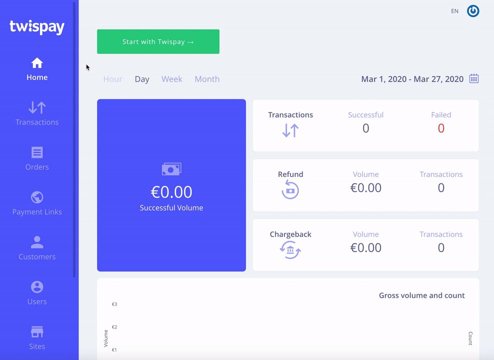

# Hosted Payment Form Documentation

## Table of contents

[Introduction](#introduction)  
[Prerequisites](#prerequisites)  
[How it works?](#how-it-works)  


## Introduction

The Twispay® hosted payment page is a securely web form designed to accept e-commerce transactions.

With this page in place, customers are redirected from the merchant's website to a payment form hosted by Twispay®,
so the merchant is no longer exposed to the sensitive payment details (Card Number, CVV, etc.) required to process a payment.   

***Note!** If your site uses one of [supported platforms](#TODO) you can skip this giude
and go directly to [modules documentation](#TODO).*


## Prerequisites
- This guide.
- An e-commerce site.
- A Twispay® merchant account. If you don't already have one you can create one [here](https://merchant-stage.twispay.com/auth/signup).
- A `siteId` and secret key (aka `apiKey`) you can get from your Twispay® merchant account. See below where to find it.



***Note!** Keep your `apiKey` private on your server. If it is exposed somebody can do malitions operations in your name.*


## How it works?

The Payment process is initiated through a HTTP POST Request to the hosted page.  

1. Prepare the checkout &#8594; 2. Create the Payment Form &#8594; 3. Receive the Payment Status


### 1. Prepare the Checkout

First, collect the required data from the customer.
The minimum mandatory parameters needed for the request are: siteId, amount, currency, orderType, cardTransactionMode, orderId, identifier, Description.

Depending on your contracted bank, you might have to include additional parameters (email, address, country, city, state, etc).

A [Full List of Request Parameters](https://github.com/Twispay/twispay.github.io/blob/master/full-request-params.md) with descriptions is available for more details. 


### 2. Create the Payment Form

On your backend server, first build the requested Json and sign it so that the customer cannot change your data. 

```
let orderData = {
    "siteId": <!--  --> mySiteId <!--  -->},
    "customer": {
        "identifier": "<myUserId>",
        "email": "<customerEmailAddress>"
    },
    "order": {
        "orderId": "<myOrderId>",
        "type": "purchase",
        "amount": 100.00,
        "currency": "EUR",
        "description": "<myPaymentDescription>"
    },
    "cardTransactionMode": "authAndCapture",
    "backUrl": "https://<myDomain>/<pathToThankYouPage>"
}

let base64JsonRequest = twispay.getBase64JsonRequest(orderData);
    base64Checksum = twispay.getBase64Checksum(orderData, myTwispaySecretKey);
```


You can create the Payment Form via hidden HTML input. 
In the POST Request parameters, you must specify the twispay® payment page URL, the payment details and the authentication information. 

The Secure URLs are : 
- https://secure.twispay.com for Production 
- https://secure-stage.twispay.com for Testing 

Here's an example of Java sample code used for generating a HTML form for a Twispay Order: 

```Java
// get the HTML form
String base64JsonRequest = Twispay.getBase64JsonRequest(jsonOrderData);
String base64Checksum = Twispay.getBase64Checksum(jsonOrderData, secretKey.getBytes(StandardCharsets.UTF_8));
String hostName = twispayLive ? "secure.twispay.com" : "secure-stage.twispay.com";
String htmlForm = "<form action=\"https://" + hostName + "\" method=\"post\" accept-charset=\"UTF-8\">\n"
    + "<input type=\"hidden\" name=\"jsonRequest\" value=\"" + base64JsonRequest + "\">\n"
    + "<input type=\"hidden\" name=\"checksum\" value=\"" + base64Checksum + "\">\n"
    + "<input type=\"submit\" value=\"Pay\">\n"
    + "</form>";
```
We also provide SDKs for: [PHP](https://github.com/Twispay/hostedpage-php-sdk), [DotNet](https://github.com/Twispay/hostedpage-dotnet-sdk), [NodeJS](https://github.com/Twispay/hostedpage-nodejs-sdk), [Python](https://github.com/Twispay/hostedpage-python-sdk), [Java](https://github.com/Twispay/hostedpage-java-sdk).

### 3. Receive the Payment Status

In this step, there are two URLs you need to provide. 
After a transaction is completed, the customer is redirected to a Payment Page Back URL. 
The request response sent by Twispay needs a landing location in the form of a "Server to Server Notification URL".  
These can be set via <>. 

The POST parameter result (result and opensslResult) sent via the “server to server notification URL” contain the following keys: externalOrderId, identifier, status, customerId, orderId, cardId, transactionId, transactionKind, timestamp, amount, currency, custom and customField.

The result parameter will be encrypted, so you will have to decrypt it to make the data readable. 
Here's how you can do so [[Link to Decryption Guide Page](https://github.com/Twispay/twispay.github.io/blob/master/Response%20Decryption%20Guide)].

See Also:

- [Testing The Intergration](https://github.com/Twispay/twispay.github.io/blob/master/integration-tests.md)
- Custom payment page specifications
- iFrame payment form
- Custom email receipt specifications
- Payout transactions for gambling (OCT/CFT)
